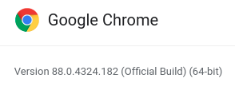

# Web Scrapping

Web scrapping with Python.



# ChromeDriver
WebDriver is an open source tool for automated testing of webapps across 
many browsers. It provides capabilities for navigating to web pages, user 
input, JavaScript execution, and more.  ChromeDriver is a standalone server 
that implements the [W3C WebDriver standard](https://w3c.github.io/webdriver/webdriver-spec.html). ChromeDriver is available for 
Chrome on Android and Chrome on Desktop (Mac, Linux, Windows and ChromeOS).  

You can view the current implementation status of the WebDriver standard 
[here](https://chromium.googlesource.com/chromium/src/+/master/docs/chromedriver_status.md).

## All versions available in Downloads
* Latest stable release: [ChromeDriver 88.0.4324.96](https://chromedriver.storage.googleapis.com/index.html?path=88.0.4324.96/)
* Latest beta release: [ChromeDriver 89.0.4389.23](https://chromedriver.storage.googleapis.com/index.html?path=89.0.4389.23/)
 


> Note: The following details reflect the Ubuntu 16.04 configuration.

```shell
$ whereis google-chrome
google-chrome: /usr/bin/google-chrome /usr/share/man/man1/google-chrome.1.gz
$ 
``` 

# References

* [Web scraping |Easy Steps for Web Scraping | Methods | Python](https://medium.com/datadriveninvestor/web-scraping-easy-steps-for-web-scraping-methods-python-da3333f8d959)
* [ChromeDriver - WebDriver for Chrome](https://chromedriver.chromium.org/downloads)
* [Selenium](https://www.seleniumhq.org/)
* [How to Setup Selenium with ChromeDriver on Ubuntu 18.04 & 16.04](https://tecadmin.net/setup-selenium-chromedriver-on-ubuntu/)
* []()

